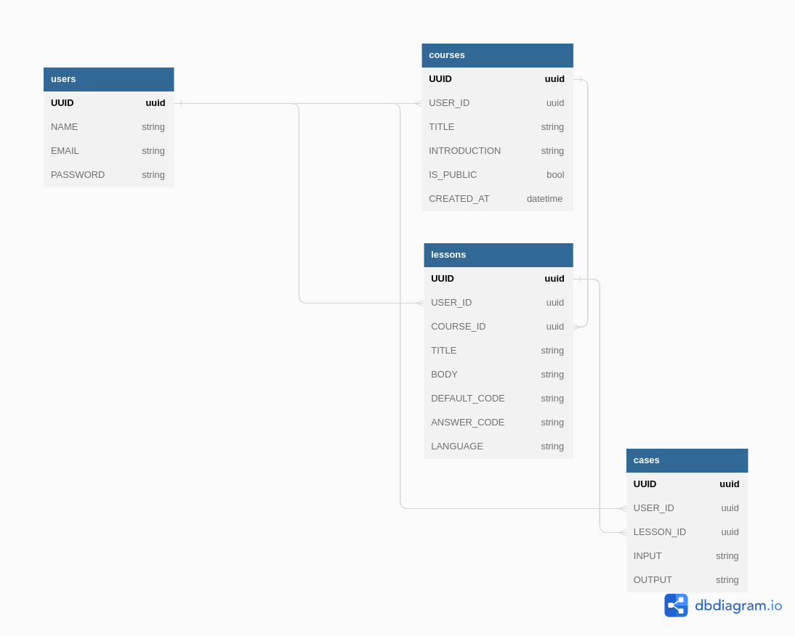

# ProgrammingCourseMarket

## URL
[https://skhole.club](https://skhole.club)  

## Network Diagram

## 使用技術
* Backend
  * Go
  * Gin
  * GORM
  * GRPC
* Frontend
  * TypeScript
  * React (functional component) + Recoil
  * Webpack
  * Linaria (CSS in JS)
* AWS
  * Route53, CloudFront, S3, AWS Secrets Manager, Amazon ECR, Amazon ECS, AWS Fargate, RDS
  * Terraform
* Docker & Docker Compose
* CI & CD (GitHub Actions)
* Bash Script

## DB Diagram

  
